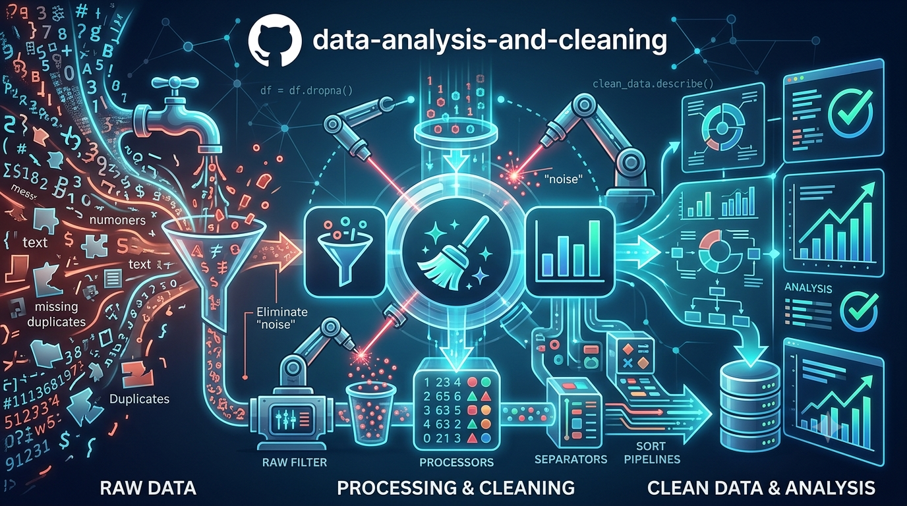

# 📊*Limpieza y Analisis de Datos*📊
```python
print("Hola")
print("Este es un código que Limpia y Analiza tus archivos CSV")
print("La intención es limpiar tus datos y graficarlos")
print("Para que puedas visualizar tu panorama y ayudarte en la toma desiciones")
```

## 🔍*Características*
### - Lectura de multiples archivos CSV
### - Se trabaja sobre la copia del archivo original
### - Eliminación de datos incoherentes, vacíos y erroneos
### - Filtro para mayores de edad
### - Corrección de nombres inconsistentes
### - Engloba los multiples archivos filtrados en uno solo
### - Devuelve reporte limpio y de errores
### - Contiene diversas graficas para la visualización de datos
### - Sección para reporte ejecutivo y concluciones
## ⚙*Instalación*
### 1.- Clona el repositorio
### 2.- Instala las dependencias desde tu terminal: 
### pip install pandas matplotlib seaborn
## ▶*Cómo usar*
### Reemplaza la dirección entre parentesis por la de tus archivos CSV en:
### glob.glob(...)
### Nota: Mucha atención en la forma de escribir la dirección de la carpeta de archivos CSV y finalizar con un .csv
### Ejecuta:
### Limpieza-y-Analisis-de-datos.py
## 🖼*Capturas*
## 🛠*Tecnologías utilizadas*
### - Python 3.13.9
### - Matplotlib
### - Pandas
### - Glob
### - Seaborn
### - Git
### - Github
## 📂*Estructura del proyecto*
## 📈*Futuras mejoras*
### Automatización completa de las conclusiones arrojadas, basandose completamente en los datos obtenidos
## 📜*Licencia*
## 🗿*Autor*
### Ricardo Brayan Juarez Valencia


